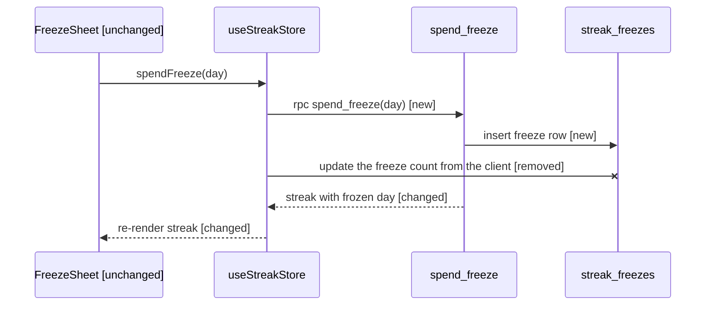

# PR story

A diff arrives in alphabetical order, which is almost never the order it makes sense
in. Re-order it so each file is read after what it depends on, and draw the one flow
that carries the most risk.

## Ground rules, shared by all six pr-* skills

- **Optional.** Nothing here gates a review or a merge; skipping this skill is always fine.
- **Sat acts alone.** Every next step you name is one the user (Sat) can take by
  themselves. On someone else's PR, work only from what already exists: the diff, the
  PR description, the linked ticket and git history. Never suggest asking the author.
- **Read-only.** No comments, reviews, labels, approvals, pushes, commits, checkouts or
  branch changes. No browser, database or running service, not even a read-only
  `SELECT`: no `psql`, no local Supabase or Docker stack. Read with `gh pr view|diff`,
  `gh issue view`, `gh api` GETs, `git fetch` (it adds objects, moves no branch),
  `git show|log|diff|grep|blame|ls-tree|merge-base|config`, `jq`, `mktemp`, `wc` and
  pr-recall's `python3 store.py`. Scratch files go under `/tmp`; pr-recall's card store
  is the only thing any pr-* skill writes.
- **Budgeted.** The budget is a ceiling, not a target: cut to fit. A line stays one
  line, never sub-bullets or a continuation. Each free-text field (a reason, question,
  claim, fact, correction) is at most 140 characters, in the text and in the JSON.
- **Pinned.** Resolve the head SHA once and compute everything against it. Open with
  the pin line `<owner>/<repo>#<n> @ <sha7>`, outside the budget.
- **Two outputs.** Plain text for Claude Code, then exactly one fenced `json` block with
  the same content, nothing extra, for the Lucidos Pulls app and review-prep rail to store.

## Budget

One diagram, plus the ordered file list at one line per step. Besides those, only the
"separate things" opener when it applies, and one line per extra flow.

## Acquire

Input: a PR number in the current repo, `owner/repo#n`, or a PR URL. Pass it to
`gh pr` as `-R <owner/repo> <n>`: gh reads `owner/repo#n` as a branch name. For a
bare number, `<owner/repo>` is `gh repo view --json nameWithOwner -q .nameWithOwner`.

```bash
T=$(mktemp -d /tmp/pr-<n>.XXXXXX); echo "$T"   # one dir per run; reuse this path: shell variables die between tool calls
gh pr view -R <owner/repo> <n> --json number,url,title,body,author,state,mergedAt,headRefName,headRefOid,baseRefOid,baseRefName,files,additions,deletions,closingIssuesReferences > "$T/pr.json"
SHA=$(jq -r .headRefOid "$T/pr.json")   # resolve ONCE: FETCH_HEAD is overwritten by any later fetch
gh pr diff -R <owner/repo> <n> > "$T/pr.diff"   # the net diff; --patch is a per-commit series that repeats files
git fetch origin "refs/pull/<n>/head" "$(jq -r .baseRefName "$T/pr.json")"
BASE=$(git merge-base "$(jq -r .baseRefOid "$T/pr.json")" "$SHA")   # the before-state
git show "${SHA}:<path>"; git grep -n '<symbol>' "$SHA"   # read the head without checking it out
```

- **zsh-safe.** Brace a SHA before a colon, `"${SHA}:<path>"` and `"${BASE}:<path>"`:
  zsh reads `$SHA:h`, `:t`, `:r` and `:e` as modifiers (`hooks/x.ts` became `.ooks/x.ts`).
  Pass each path as its own quoted word: zsh never splits an unquoted `$VAR` into words.
- `repo` in the JSON is `owner/name`, taken from the PR URL.
- **Own PR**: `author.login` equals `gh api user -q .login`.
- **Not cloned locally** (or `origin` is another repo): read files with
  `gh api "repos/<owner/repo>/contents/<path>?ref=${SHA}" -H 'Accept: application/vnd.github.raw'`
  and history with `gh api "repos/<owner/repo>/commits?path=<path>"`.

## Step 1 — Order the files

Group every changed file into steps, so that each file comes after what it depends on.

- The default order is types → data → logic → UI → tests. Rename the layers to fit the
  repo: migrations → RPCs → store → screens → tests for a Supabase app, models →
  services → view models → views → tests for a Swift one.
- Config and CI go where they take effect. pr-lanes' Trust-class files (docs, QA specs,
  translations, fixtures, generated code, agent prompts that change no gate) go in a
  final `skip` step: docs are never a layer. Files in an import cycle share one step,
  at the earliest layer among them.
- At most 8 steps, not counting `skip`: merge the smallest adjacent ones to fit. A PR
  of Trust-class files only (docs, skills, slash commands) orders them in the steps.

Line: `<n>. <layer> — <files> — <what changes>`. Name at most 4 files per line by
basename, then `+N more`. Colliding basenames take the shortest unique tail of their
path: `en-US/translations.json`, `de-DE/translations.json`.

Done when every changed file sits in exactly one step: count them against `files` in
the metadata.

## Step 2 — Find the flows

A **flow** is one distinct behaviour change, traced from the entry point that runs it
through the changed code. Its `kind` names that entry: `screen` (a screen action),
`endpoint`, `job`, `cli` (a CLI or slash command), `webhook`, `event` (an SDK, realtime
or OS callback), `launch` (app start, a root mount effect), else `other` (a git or
agent hook). Walk each changed function's callers up (`git grep -n '<name>' "$SHA"`).
A **changed function** is the innermost named function around a changed line (a
declaration, a method, `const onSave = …`); an inline callback, such as an effect body,
belongs to the one around it, and outside any function the changed hunk stands in.
Imports and module-level constants and types are never one: they score with the flow
that uses the name.

- One flow per entry action: changes reached from the same entry through the same
  changed function are one flow, and so are callers reaching the change only through
  one changed shared module (a hook, store, util, component). Its entry and `kind` come
  from what really triggers it: a tap in the screens using the module is `screen`.
- A moved registration (a listener, a subscription, a bridge holding one) is one flow,
  entered at the callback where its effect is observed, not where it is registered.
- Score a flow by its **changed lines**, each once: the added plus removed lines of
  `git diff -w "$BASE" "$SHA"`, not counting blank or comment-only lines. Every count
  uses them: the size gate, Step 3's tie-break, `changed_lines`. A line **serves** a
  flow when that flow's behaviour change depends on what the line changes, not just
  because the flow runs it: a fixed query bound serves the flow cut for that fix, not
  every flow reading its rows. A line serving two flows scores in the one with more
  categories (Step 3's test), then more changed lines, both without shared lines. A
  pure refactor or speed-up serves the flows that run it, never a flow of its own.
- A flow left with no lines of its own is **emptied**: it stays, with 0 changed lines,
  in the group of the flow that took most of its lines. It never makes a group a thing
  or a small fix, and is never diagrammed.
- In no flow: Trust-class files and tests. Agent markdown (a skill, a slash command,
  `CLAUDE.md`) joins a flow only through its gate-changing lines, starting at what runs
  them: only those lines score, and only their categories count.

Nothing that runs reaches changed code (docs or slash-command markdown only, config,
renames, dependency bumps): no flows, so skip Step 3 and output only the file list.

**Groups.** Two flows share a group when one changed function holds lines scored in
each, or when changed lines in each call the same function the diff adds or changes.
A function the PR deletes or splits counts as changed: its pieces are read against it.
Never joined by: a shared file alone, a mechanical call-site edit (it only follows a
rename, import swap or signature change made elsewhere), a root, route table or index
that only mounts, routes to or exports each piece, or an always-loaded instruction
file (`CLAUDE.md`, `AGENTS.md`).

A group is a **thing**, a review of its own, when its scored lines hold a sensitive
category (Step 3's test) and ≥4 changed lines, or ≥20; any other group is a small fix.
With N ≥ 3 things, open the output (after the pin) with `This PR does N separate
things.`, or with K small fixes, `This PR does N separate things, plus K small fixes.`

## Step 3 — Diagram the riskiest flow

Draw one flow as one ```` ```mermaid ```` `sequenceDiagram`. Exactly one diagram per run.

- Pick by risk, not size. Recompute pr-lanes' sensitive categories per flow over every
  line serving it, shared or not, with pr-lanes' test: a line must alter the category,
  not just read, render or memoize it. Most categories wins; changed lines break a tie.
- At most about 8 participants and 15 messages. If the flow is bigger, draw it at
  module level: participants become modules or services, messages the calls between them.
- Draw the changed hops, unchanged hops that connect two changed ones, the unchanged
  entry hop, and at most one unchanged terminal hop where the risk lands (the table a
  change locks, the service it calls). End a new hop's text with ` [new]` and a changed
  hop's with ` [changed]`. Draw a hop the PR removes with `-x`, ending ` [removed]`.
- End every unchanged participant's label with ` [unchanged]`. Docs are never a participant.
- Participant ids are bare identifiers (`participant SS as StreakService`). Message
  text stays free of `;` and `#`, which break parsing, and of `file:line` citations.

Under the diagram, one line per other flow: every thing's top flow, then emptied flows,
then the rest, each part by risk then changed lines. At most 5, then `+N more flows`:
`Also: <entry> → <deepest changed hop> (<N> changed lines)`, or `(no lines of its own)`
for an emptied flow.

## Output

Order: pin, the "separate things" opener if any, the diagram, the `Also:` lines, the steps.

````
pr-zone/przone-app#971 @ 3f9c2ab

Also: nightly streak_reset job → reset_streaks (12 changed lines)
1. data — 0042_streak_freezes.sql — adds streak_freezes and spend_freeze()
2. logic — useStreakStore.ts, streak.ts — spends a freeze through the RPC, keeps frozen days
3. UI — StreakCard.tsx — frozen-day badge
4. tests — streak.test.ts — frozen day keeps the streak
5. skip — database.types.ts, en.json — generated from the migration; badge copy
````

```json
{
  "schema": "pr-skills/story/v2",
  "pr": {"repo": "pr-zone/przone-app", "number": 971, "url": "https://github.com/pr-zone/przone-app/pull/971", "head_sha": "<40-hex>"},
  "generated_at": "2026-09-27T09:14:00Z",
  "separate_things": null, "small_fixes": null,
  "flows": [
    {"entry": "FreezeSheet: tap Use freeze", "kind": "screen", "group": 1, "changed_lines": 142, "diagrammed": true},
    {"entry": "nightly streak_reset job", "kind": "job", "group": 2, "changed_lines": 12, "diagrammed": false}
  ],
  "diagram": {"level": "function", "participants": 4, "messages": 6, "mermaid": "sequenceDiagram\n  participant FS as FreezeSheet [unchanged]\n  ..."},
  "steps": [
    {"n": 1, "layer": "data", "files": ["supabase/migrations/0042_streak_freezes.sql"], "what": "adds streak_freezes and spend_freeze()"},
    {"n": 2, "layer": "logic", "files": ["app/stores/useStreakStore.ts", "supabase/functions/streak.ts"], "what": "spends a freeze through the RPC, keeps frozen days"},
    {"n": 3, "layer": "UI", "files": ["app/streak/StreakCard.tsx"], "what": "frozen-day badge"},
    {"n": 4, "layer": "tests", "files": ["app/stores/streak.test.ts"], "what": "frozen day keeps the streak"},
    {"n": 5, "layer": "skip", "files": ["types/database.types.ts", "app/i18n/en.json"], "what": "generated from the migration; badge copy"}
  ]
}
```

`flows` holds every flow, the diagrammed one first, then in `Also:` order. `group`
numbers the groups from 1 in that order. `separate_things` is N, the count of things,
when it is 3 or more, else `null`; `small_fixes` is K (0 or more) beside it, else
`null`. `kind` is one of Step 2's kinds; `level` is `function|module`; `diagram` is
`null` when there are no flows. The JSON `files` lists every path in full, unlike the
text line. **v2**: flows gain `group`; `kind` gains `event` and `launch`;
`changed_lines` counts Step 2's changed lines; `flows` lists every flow, in the order
above. Added later, so older v2 files lack them: `small_fixes` (read `null`), emptied
flows with `changed_lines: 0`, counting on `git diff -w` without blanks or comments,
and serving by dependence.
