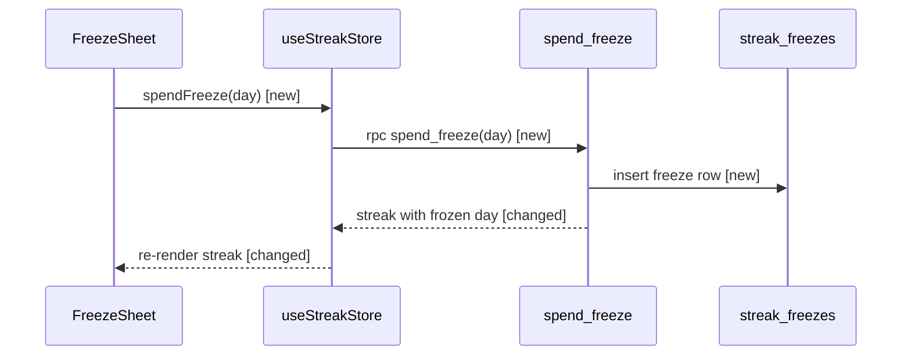

# PR story

A diff arrives in alphabetical order, which is almost never the order it makes sense
in. Re-order it so each file is read after what it depends on, and draw the one flow
that carries most of the change.

## Ground rules

Shared by all six pr-* skills.

- **Optional.** Nothing here gates a review or a merge; skipping this skill is always fine.
- **Sat acts alone.** Every next step you name is one the user (Sat) can take by
  themselves. On someone else's PR, work only from what already exists: the diff, the
  PR description, the linked ticket and git history. Never suggest asking the author.
- **Read-only.** Toward GitHub and every repo: no comments, reviews, labels, approvals,
  pushes, commits, checkouts or branch changes, and never a browser. Use `gh` and `git`
  read commands only: `gh pr view|diff`, `gh issue view`, `gh api` GETs,
  `git show|log|diff|grep|blame|ls-tree|merge-base`, and `git fetch` (it adds objects
  and moves no local branch). Scratch files under `/tmp` are fine. pr-recall's card
  store is the only thing any pr-* skill writes.
- **Budgeted.** The budget is a ceiling, not a target: cut to fit. A line stays one
  line, never sub-bullets or a continuation. Each free-text field (a reason, claim,
  fact, correction) is at most 140 characters, in the text and in the JSON.
- **Pinned.** Resolve the head SHA once and compute everything against it. Open with
  the pin line `<owner>/<repo>#<n> @ <sha7>`, outside the budget.
- **Two outputs.** Plain text to read in Claude Code, then exactly one fenced `json`
  block for the Lucidos Pulls app and review-prep rail: the same content, nothing
  extra. The caller stores the JSON; this skill writes no file.

## Budget

One diagram, plus the ordered file list at one line per step. Besides those, only the
"separate things" opener when it applies, and one line per extra flow.

## Acquire

Input: a PR number in the current repo, `owner/repo#n`, or a PR URL.

```bash
gh pr view <pr> --json number,url,title,body,author,state,mergedAt,headRefOid,baseRefOid,baseRefName,files,additions,deletions,closingIssuesReferences > /tmp/pr-<n>.json
SHA=$(jq -r .headRefOid /tmp/pr-<n>.json)   # resolve ONCE: FETCH_HEAD is overwritten by any later fetch
gh pr diff <pr> > /tmp/pr-<n>.diff            # the net diff; --patch is a per-commit series that repeats files
git fetch origin "refs/pull/<n>/head" "$(jq -r .baseRefName /tmp/pr-<n>.json)"
BASE=$(git merge-base "$(jq -r .baseRefOid /tmp/pr-<n>.json)" "$SHA")   # the before-state
git show "$SHA:<path>"; git grep -n '<symbol>' "$SHA"   # read the head without checking it out
```

- `repo` in the JSON is `owner/name`, taken from the PR URL.
- **Own PR**: `author.login` equals `gh api user -q .login`.
- **Not cloned locally** (or `origin` is another repo): read files with
  `gh api "repos/<owner>/<repo>/contents/<path>?ref=$SHA" -H 'Accept: application/vnd.github.raw'`
  and history with `gh api "repos/<owner>/<repo>/commits?path=<path>"`.

## Step 1 — Order the files

Group every changed file into steps, so that each file comes after what it depends on.

- The default order is types → data → logic → UI → tests. Rename the layers to fit the
  repo: migrations → RPCs → store → screens → tests for a Supabase app, models →
  services → view models → views → tests for a Swift one.
- Config and CI go where they take effect.
- Lockfiles, snapshots, generated code, vendored deps and pure renames go in a final
  `skip` step.
- At most 8 steps: merge the smallest adjacent ones to fit.

Line: `<n>. <layer> — <files> — <what changes>`. Name at most 4 files per line, by
basename where that is unambiguous, then `+N more`.

Done when every changed file sits in exactly one step: count them against `files` in
the metadata.

## Step 2 — Find the flows

A **flow** is one entry point (a screen action, an endpoint, a job, a CLI command, a
webhook) traced through the changed code.

For each changed function, walk its callers up (`git grep -n '<name>' "$SHA"`) to an
entry point. Changed code sharing an entry point is one flow. Score each flow by the
changed lines (added plus removed) on its path.

When no entry point reaches any changed code (config, renames, dependency bumps) there
are no flows: skip Step 3 and output only the file list.

## Step 3 — Diagram the top flow

Draw the highest-scoring flow as one ```` ```mermaid ```` `sequenceDiagram`. Exactly one
diagram per run.

- At most about 8 participants and 15 messages. If the flow is bigger, draw it at
  module level: participants become modules or services, messages the calls between them.
- Draw the changed hops, plus unchanged hops only where they connect two changed ones.
  End a new hop's text with ` [new]` and a changed hop's with ` [changed]`.
- Participant ids are bare identifiers (`participant SS as StreakService`). Message
  text stays free of `;` and `#`, which break parsing, and of `file:line` citations.

Under the diagram, one line per other flow, at most 5, then `+N more flows`:
`Also: <entry> → <deepest changed hop> (<N> changed lines)`

With 3 or more flows in total, open the output (after the pin) with
`This PR does N separate things.` That is a finding: each flow is a review of its own.

## Output

Order: pin, the "separate things" opener if any, the diagram, the `Also:` lines, the steps.

````
pr-zone/przone-app#971 @ 3f9c2ab

Also: nightly streak_reset job → reset_streaks (12 changed lines)
1. data — 0042_streak_freezes.sql — adds streak_freezes and spend_freeze()
2. logic — useStreakStore.ts, streak.ts — spends a freeze, treats frozen days as kept
3. UI — FreezeSheet.tsx, StreakCard.tsx — new sheet, frozen-day badge
4. tests — streak.test.ts — frozen day keeps the streak
5. skip — database.types.ts — generated from the migration
````

```json
{
  "schema": "pr-skills/story/v1",
  "pr": {"repo": "pr-zone/przone-app", "number": 971, "url": "https://github.com/pr-zone/przone-app/pull/971", "head_sha": "<40-hex>"},
  "generated_at": "2026-09-27T09:14:00Z",
  "separate_things": null,
  "flows": [
    {"entry": "FreezeSheet: tap Use freeze", "kind": "screen", "changed_lines": 142, "diagrammed": true},
    {"entry": "nightly streak_reset job", "kind": "job", "changed_lines": 12, "diagrammed": false}
  ],
  "diagram": {"level": "function", "participants": 4, "messages": 5, "mermaid": "sequenceDiagram\n  participant FS as FreezeSheet\n  ..."},
  "steps": [
    {"n": 1, "layer": "data", "files": ["supabase/migrations/0042_streak_freezes.sql"], "what": "adds streak_freezes and spend_freeze()"},
    {"n": 2, "layer": "logic", "files": ["app/stores/useStreakStore.ts", "supabase/functions/streak.ts"], "what": "spends a freeze, treats frozen days as kept"},
    {"n": 3, "layer": "UI", "files": ["app/streak/FreezeSheet.tsx", "app/streak/StreakCard.tsx"], "what": "new sheet, frozen-day badge"},
    {"n": 4, "layer": "tests", "files": ["app/stores/streak.test.ts"], "what": "frozen day keeps the streak"},
    {"n": 5, "layer": "skip", "files": ["types/database.types.ts"], "what": "generated from the migration"}
  ]
}
```

`separate_things` is the flow count when it is 3 or more, else `null`. `kind` is
`screen|endpoint|job|cli|webhook|other`. `level` is `function|module`. `diagram` is
`null` when there are no flows. The JSON `files` lists every path in full, unlike the
text line.
